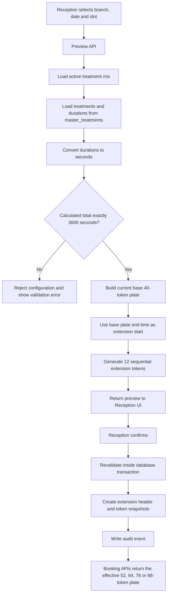

# Slot-Specific Extra Tokens: Implementation Plan and Flow

## 1. Objective

Allow Reception to append up to four additional 60-minute token blocks, one by one, for one selected:

- branch
- appointment date
- slot

The default 40-token branch layout must remain unchanged. The additional block is available only for the selected branch, date, and slot.

## 2. Source-of-Truth Rules

The feature must not maintain treatment durations in controllers, frontend components, or extension configuration.

### Treatment master

`master_treatments` remains the source for:

- treatment ID
- treatment code
- treatment name
- `estimated_duration_minutes`
- active status

Add a stable unique `treatment_code` if it does not already exist:

| Treatment | Treatment code | Master duration |
|---|---|---:|
| Acute Treatment | `ACUTE_TREATMENT` | 2.00 minutes |
| First Consultation | `FIRST_CONSULTATION` | 10.00 minutes |
| Follow-up Visit | `FOLLOW_UP_VISIT` | 4.50 minutes |
| Chronic Case Discussion | `CHRONIC_CASE_DISCUSSION` | 14.00 minutes |

Treatment names and numeric treatment IDs must not be used as business identifiers.

### Extra-hour treatment mix

Only the required token count and display order are maintained separately:

| Treatment code | Token count | Calculated minutes |
|---|---:|---:|
| `ACUTE_TREATMENT` | 2 | 4 |
| `FIRST_CONSULTATION` | 2 | 20 |
| `FOLLOW_UP_VISIT` | 8 | 36 |
| **Total** | **12** | **60** |

The system calculates the last column from `master_treatments.estimated_duration_minutes`.

No extension duration value such as `2`, `10`, or `4.5` is duplicated in configuration.

### Extra-hour alignment template

Reception may drag and drop the 12 treatment positions in the existing Token
Alignment Configuration. The saved branch template is reused for blocks 1
through 4. It changes only the order; treatment counts and master durations
remain fixed. Already-created extension snapshots are not rewritten.

## 3. Core Calculation

```text
extension_minutes =
    SUM(treatment_token_count * master_treatment_duration)
```

Creation is allowed only when:

```text
extension_minutes = 60.00
```

The current treatment mix produces:

```text
2 Acute tokens      * 2.00 minutes  =  4 minutes
2 First tokens      * 10.00 minutes = 20 minutes
8 Follow-up tokens  * 4.50 minutes  = 36 minutes
                                            ----
Total: 12 tokens                          60 minutes
```

Calculations must use decimal minutes internally. Convert decimal minutes to seconds for sequencing:

```text
4.50 minutes = 270 seconds
```

This prevents cumulative rounding errors.

## 4. Database Design

### 4.1 Treatment master update

Add:

```text
master_treatments.treatment_code VARCHAR(50) UNIQUE NOT NULL
```

The application should use `treatment_code` instead of treatment-name matching or fallback treatment IDs.

### 4.2 Extra-hour mix master

Create `master_token_extension_mix`:

```text
id
fk_treatment_id
token_count
display_order
is_active
created_at
updated_at
created_by
updated_by
```

Rules:

- one active row per treatment
- `token_count` must be positive
- duration is never stored here
- initial active rows are Acute `2`, First `2`, and Follow-up `8`

### 4.3 Slot extension header

Create `tbl_slot_token_extensions`:

```text
id
fk_branch_id
fk_slot_id
appointment_date
base_token_count
extra_token_count
total_duration_seconds
status
created_by
created_at
cancelled_by
cancelled_at
cancellation_reason
created_ip
```

Status values:

```text
ACTIVE
CANCELLED
```

Up to four active extension blocks may exist for the same:

```text
branch + slot + appointment_date
```

Each block has `block_number` from `1` to `4`. A new block starts after the
last token and end time of the previous active block.

### 4.4 Generated token snapshot

Create `tbl_slot_extension_tokens`:

```text
id
fk_extension_id
token_number
sequence_number
fk_treatment_id
treatment_code_snapshot
treatment_name_snapshot
duration_seconds
estimated_start_time
estimated_end_time
created_at
```

These rows are generated from the current master data when the extension is created.

Snapshots are required because a later treatment-duration change must not change an already-created extension or an existing appointment.

### 4.5 Audit log

Create `tbl_slot_token_extension_audit_logs`:

```text
id
fk_extension_id
action
old_data_json
new_data_json
performed_by
performed_by_role
performed_at
ip_address
```

Actions:

```text
PREVIEWED
CREATED
CREATE_REJECTED
CANCELLED
CANCEL_REJECTED
BOOKING_REJECTED
```

## 5. Shared Backend Service

Create one shared token-plate service. Patient booking, Reception booking, live queue, and token display must consume the same generated plate.

Suggested responsibilities:

```text
loadBaseTokenLayout(branchId)
loadTreatmentDurations()
loadExtensionMix()
validateExtensionMix()
buildBaseTokenPlate(context)
buildExtensionPreview(context)
loadActiveExtension(context)
buildEffectiveTokenPlate(context)
resolveDynamicTokenLimit(context)
```

`buildEffectiveTokenPlate()` returns:

```text
base token plate (#1 onward)
    +
active extension snapshot tokens
```

Existing `utils/appointmentTokens.js` should be refactored incrementally into this shared service instead of creating another independent calculation path.

## 6. Token Generation Flow



Token numbers must not be hardcoded to `41-52`.

```text
first_extra_token = base_token_count + 1
last_extra_token  = base_token_count + extra_token_count
```

With the current base layout, the sequential ranges are:

```text
Block 1: #41-#52
Block 2: #53-#64
Block 3: #65-#76
Block 4: #77-#88
```

## 7. APIs

### Preview

```http
GET /api/v1/receptionist/token-extensions/preview
```

Query:

```text
branch_id
slot_id
appointment_date
```

Response includes:

- selected branch/date/slot
- base token count
- extension token count
- master-derived treatment durations
- calculated total seconds/minutes
- generated token numbers and timings
- whether an active extension already exists
- any blocking validation

### Create

```http
POST /api/v1/receptionist/token-extensions
```

Body:

```json
{
  "branch_id": 1,
  "slot_id": 1,
  "appointment_date": "2026-06-10"
}
```

The client must not send token counts, durations, token numbers, or calculated times.

### Fetch

```http
GET /api/v1/receptionist/token-extensions
GET /api/v1/receptionist/token-extensions/:extension_id
```

### Cancel

```http
POST /api/v1/receptionist/token-extensions/:extension_id/cancel
```

Body:

```json
{
  "reason": "Doctor availability changed"
}
```

Use cancellation instead of hard deletion.

## 8. Reception UI Flow

Add an `Extra Slot Tokens` section to the Receptionist Dashboard.

### User flow

1. Reception selects branch.
2. Reception selects appointment date.
3. Reception selects slot.
4. UI checks whether an active extension exists.
5. Reception clicks `Preview Extra 1-Hour Tokens`.
6. UI displays the next server-generated 12-token block preview.
7. Reception clicks `Confirm and Add`.
8. UI reloads the booking plate and shows extension tokens with an `EXTRA` badge.

Preview summary:

```text
Additional time: 60 minutes
Additional tokens: 12
Token range: next sequential 12-token range
Acute: 2
First: 2
Follow-up: 8
```

The UI must not:

- calculate duration
- generate token numbers
- maintain treatment counts
- infer treatment type from treatment name

It only renders the API response.

## 9. Booking Integration

Both Patient and Reception booking flows must call the effective token-plate builder.

Booking validation:

1. Load selected treatment and its `treatment_code`.
2. Build the effective token plate for branch/date/slot.
3. Find the requested token in that plate.
4. Confirm that its treatment code matches the selected treatment.
5. Confirm that it is not already booked.
6. Store the selected token's duration snapshot in `assigned_slot_duration_minutes`.
7. Commit the appointment inside the existing collision-safe transaction.

The existing appointment uniqueness rule for branch, slot, date, token, and active status remains the final double-booking protection.

## 10. Edit and Cancellation Rules

### Allowed

- cancel a future active extension when none of its tokens are booked
- view extension and audit history
- create another extension after the previous one is cancelled

### Blocked

- more than four active blocks for the same branch/date/slot
- cancellation of a block while a later block is active
- extension creation for a past date
- extension creation for an inactive branch, slot, or treatment
- extension creation when the master-derived total is not exactly 60 minutes
- editing generated tokens after creation
- cancellation when any extension token has an active appointment
- hard deletion

If treatment durations or counts must change, update master/configuration for future extensions. Existing extension snapshots remain unchanged.

## 11. Existing Duplicate Logic to Remove

### Treatment identity

Replace:

- treatment-name comparisons
- fallback numeric treatment ID maps

With:

- `master_treatments.treatment_code`

### Duration

Replace hardcoded duration totals in `TOKEN_PLATE_VISIT_TYPE_RULES` with master-derived durations.

The base layout may continue to maintain token counts/order, but duration must come from the treatment master.

### Count validation

Move controller-specific checks such as exact Acute, First, Chronic, and Follow-up counts into one reusable layout validation service.

### Token range

Replace global `MAX_TOKEN_NUMBER` request validation with:

```text
effective token count for selected branch + date + slot
```

The default remains 40. It becomes 52, 64, 76 or 88 according to the number
of active one-hour blocks in that context.

### Plate calculation

Remove separate calculations from:

- Patient booking
- Reception booking
- live queue
- token display

All modules must consume the same effective token plate or appointment snapshot.

## 12. Permission Model

- Receptionist can preview and create extensions for an authorized branch.
- Doctor can view extensions.
- Doctor access to create/cancel can be added through an explicit permission, not role impersonation.
- Patient cannot create, edit, or cancel extensions.
- Every mutation is branch-scoped and audited.

## 13. Concurrency and Transactions

Extension creation transaction:

1. lock the branch/date/slot extension context
2. confirm no active extension exists
3. reload treatment mix and durations
4. validate exactly 3600 seconds
5. generate token snapshots
6. insert extension header
7. insert all token rows
8. insert audit event
9. commit

Booking transaction:

1. build or load the effective plate
2. verify requested token and treatment
3. check existing active appointment
4. insert appointment
5. rely on the database unique constraint as final protection

## 14. Testing Plan

### Unit tests

- decimal duration converts correctly to seconds
- configured mix calculates exactly 3600 seconds
- incorrect mix is rejected
- token numbering begins after the base plate
- extension timing begins after the base plate
- treatment code matching works without names or fixed IDs

### API tests

- preview returns 12 tokens and 60 minutes
- duplicate extension is rejected
- inactive branch/slot/treatment is rejected
- past date is rejected
- cancellation succeeds when no extension token is booked
- cancellation fails when an extension token is booked
- unauthorized branch access is rejected

### Integration tests

- default context returns 40 tokens
- one through four blocks return 52, 64, 76, and 88 tokens
- another date, branch, or slot still returns 40 tokens
- Patient can book a matching extension token
- Reception can book a matching extension token
- mismatched treatment token is rejected
- simultaneous booking cannot double-book a token
- existing base-token appointments and timings remain unchanged
- live queue uses the saved appointment duration snapshot

## 15. Implementation Sequence

### Phase 1: Master cleanup

1. Add and populate `treatment_code`.
2. Remove dependency on treatment names and fallback IDs.
3. Make shared treatment metadata available to token services.

### Phase 2: Extension persistence

1. Add extension mix master.
2. Add extension header table.
3. Add generated token snapshot table.
4. Add audit table and constraints.

### Phase 3: Shared calculation

1. Add decimal-minute-to-seconds helpers.
2. Add master-driven duration loading.
3. Add extension validation and preview generation.
4. Add effective token-plate builder.

### Phase 4: APIs

1. Add preview endpoint.
2. Add create endpoint with transaction and locking.
3. Add list/detail endpoints.
4. Add cancellation endpoint and booking checks.

### Phase 5: Booking and queue integration

1. Replace fixed maximum-token validation.
2. Integrate Patient booking.
3. Integrate Reception booking.
4. Integrate live queue and token display.

### Phase 6: Reception UI

1. Add branch/date/slot selector.
2. Add preview modal.
3. Add confirm/cancel actions.
4. Add `EXTRA` badges and extension status.
5. Add audit-history view.

### Phase 7: Verification

1. Run unit and API tests.
2. Run booking collision tests.
3. Verify base 40-token regression.
4. Verify selected-context 52, 64, 76 and 88-token behavior.
5. Verify decimal timing through booking and live queue.

## 16. Completion Criteria

The feature is complete when:

- default branch layout remains 40 tokens
- only the selected branch/date/slot receives the extension
- the 12-token mix is derived from active master treatments
- the calculated duration is exactly 60 minutes
- no frontend or controller duplicates treatment durations
- Patient and Reception see the same effective token plate
- booked token collisions are database-protected
- created extensions are immutable snapshots
- cancellation and rejected actions are audited
- existing booking and live-queue behavior passes regression tests
